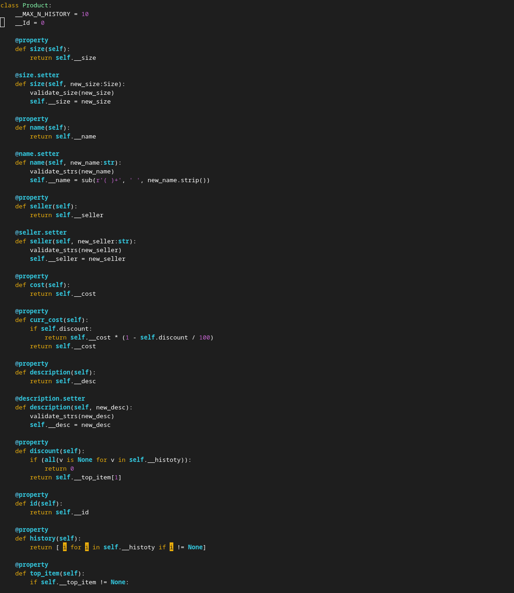
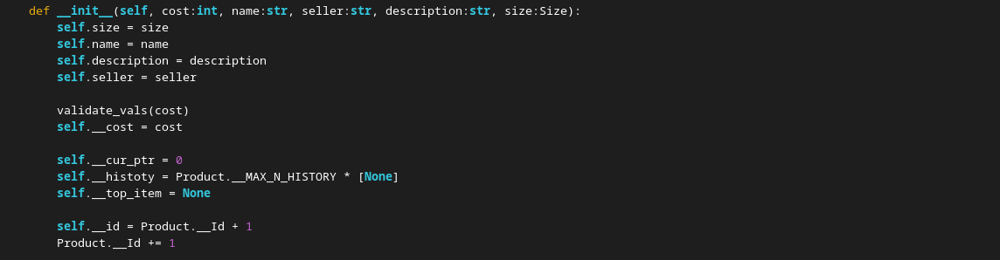
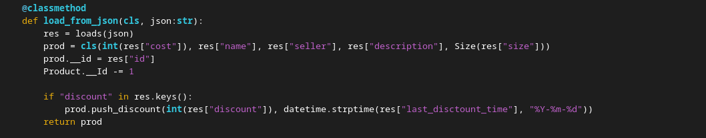
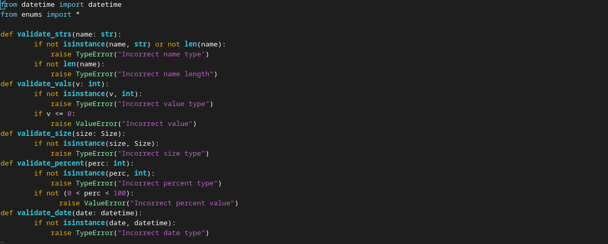
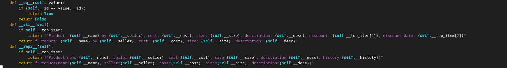
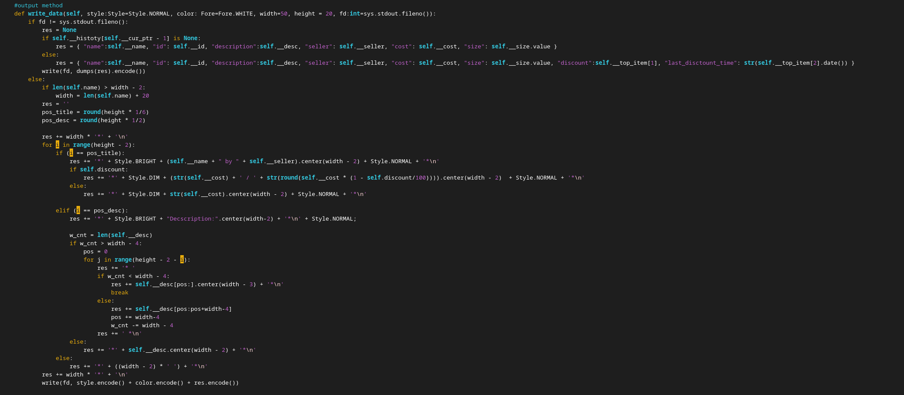
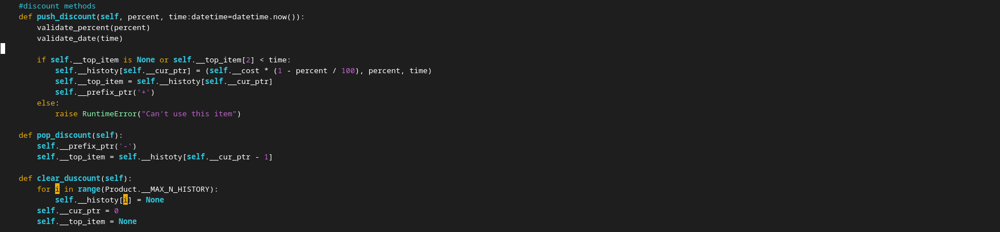
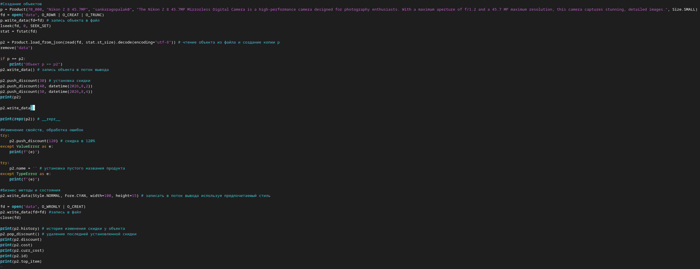
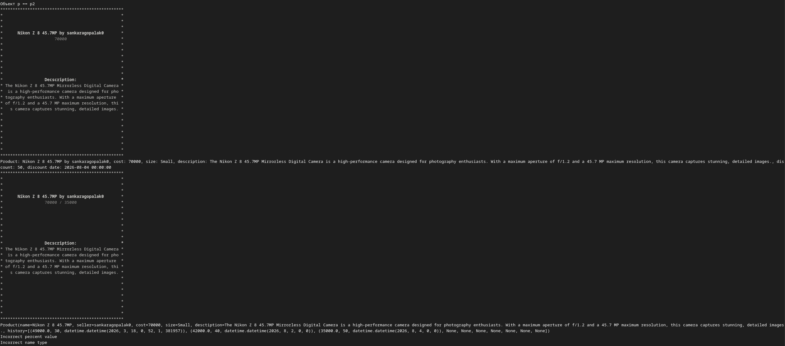
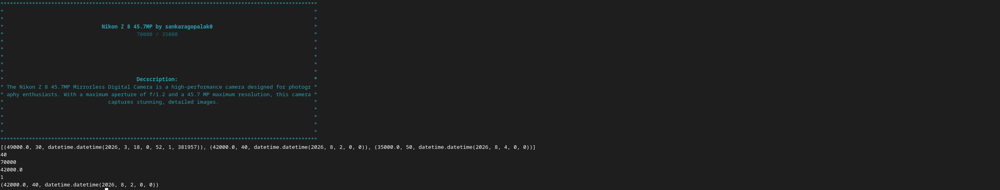

# Лабораторная работа №1:

## Атрибуты класса
### `__MAX_N_HISTORY` - Константная атрибута для максимального количества записей в массиве истории изменения цен.
### `__Id` - Генерация индвивидуального идентификатора продукта.
## Приватные атрибуты объекта
### `__id` - Уникальный идентификатор товара.
### `__name` - Название товара.
### `__seller` - Никнейм продавца.
### `__cost` - Базовая стоимость товара.
### `__size` - Размер товара.
### `__des` - Описание товара.
### `__histoty` - Буффер для хранения истории изменения скидок. Каждый элемент - кортеж формата (цена, процент, дата).
### `__cur_ptr` - Указатель текущей позиции в буфере.
### `__top_item` - Последняя актуальная запись о скидке.

## Свойства
### `size` - Возвращает размер товара.
### `name` - Возвращает название товара.
### `seller` - Возвращает никнейм продавца.
### `description` - Возвращает описание товара.
### `curr_cost` - Возвращает текущую стоимость товара с учётом активной скидки.
### `cost` - Возвращает базовую стоимость товара.
### `discount` - Возвращает текущий процент скидки.
### `id` - Возвращает уникальный идентификатор товара.
### `history` - Возвращает список всех записей истории.
### `top_data` - Возвращает последнюю запись о скидке.

## Свойства с сеттерами
### `name` - При установке проверяет валидность строки, удаляет лишние пробелы.
### `seller` - При установке проверяет валидность строки.
### `size` - При установке проверяет, является ли значение типом Size.
### `description` - При установке проверяет валидность строки.

## Конструктор
### Принимает параметры - стоимость, название продавца, описание и размер. Выполняет валидацию и инициализацию

## Метод класса
### `load_from_json(json_str)` - создаёт экземпляр товара из json-строки

## Методы валидации 
### `validate_strs(name: str)`
### `validate_vals(v: int)`
### `validate_size(size: Size)`
### `validate_percent(perc: int)`
### `validate_date(date: datetime)`

## Магические методы
### `__str__` - возвращает удобночитаемое представление продукта
### `__repr__` - возвращает строку, которая позвояет воссоздать объект
### `__eq__` - сравнивает продукты по уникальному идентификатору

## Бизнес-методы
### `write_data(style, color, width, height, fd)` - позволяет стилизованно и удобно вывести всю информацию в поток вывода в виде карточки товара если не указан файловый дескриптор или записать в файл в json-формате

### `push_discount(percent, time)` - добавляет новую скидку
### `pop_discount()` - удаляет последнюю добавленнную скидку
### `clear_discount()` - удаляет всю историю скидок

### /lab01/demo.py

### Вывод

