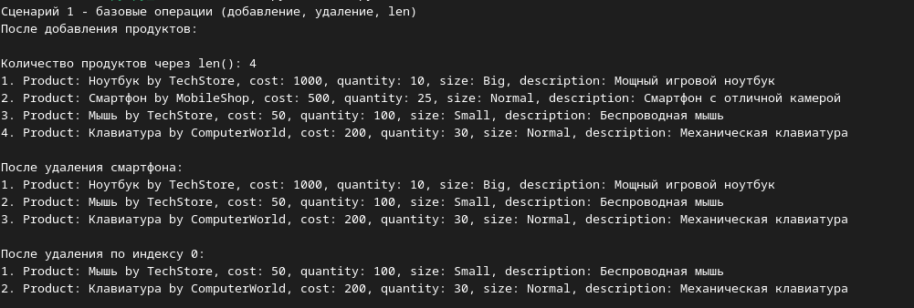
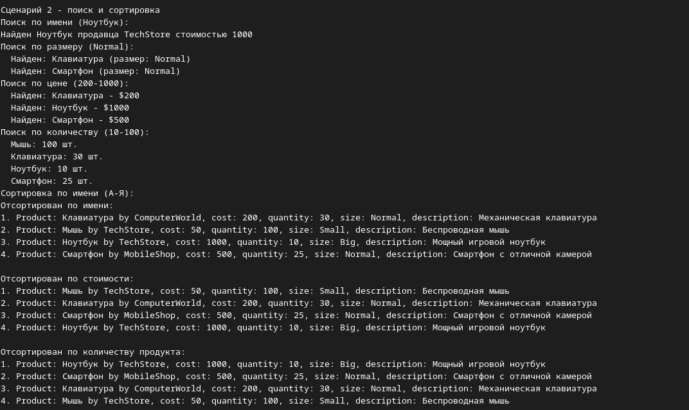
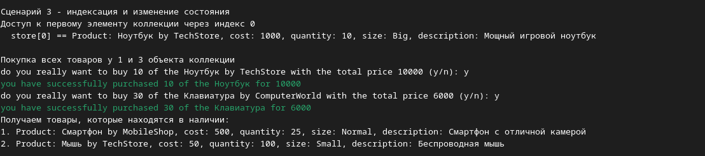

# Лабораторная работа №2 (ProductCollection)

## Вариант: Торговля / Управление товарами (класс Product из ЛР-1)

# Основные методы
### `append(product)`
  
* Добавляет объект Product в коллекцию.

* Проверяет тип: можно добавлять только экземпляры Product.

* Запрещает дубликаты – два товара с одинаковым `id` или с одинаковой комбинацией `name` + `seller` не могут находиться в коллекции.

### `remove(product)`
* Удаляет конкретный объект товара из коллекции по совпадению `id`.

* Если товара нет – ничего не происходит (без выброса исключения).

### `remove_at(index)` 
* Удаляет товар по индексу (поддерживаются отрицательные индексы, например `-1` для последнего).

* При неверном индексе выбрасывает `IndexError`.

### `get_all()`
* Возвращает копию списка всех товаров в коллекции.

# Магические методы
### `__len__()`
* Возвращает количество товаров в коллекции.
* Позволяет использовать `len(collection)`.

### `__iter__()`
* Возвращает итератор по списку товаров.
* Позволяет писать `for product in collection:`.

### `__getitem__()`
* Поддерживает индексацию: `collection[0]`, `collection[-1]`.

* При неверном индексе выбрасывает `IndexError`.

### `__str__()`
* Возвращает строковое представление коллекции с нумерованным списком всех товаров.

# Поиск
### `find_by_name(name)`
* Возвращает коллекцию товаров, у которых имя совпадает с указанным (регистронезависимо).

### `find_by_id(id)`
* Возвращает товар с указанным идентификатором.

* ID уникален, поэтому возвращается один объект (не коллекция).

### `find_by_seller(seller)`
* Возвращает коллекцию товаров указанного продавца.

### `find_by_cost(min, max)`
* Возвращает коллекцию товаров, текущая стоимость которых (с учётом скидки) находится в диапазоне `[min, max]`.

### `find_by_quantity(min, max)`
* Возвращает коллекцию товаров, количество которых находится в диапазоне `[min, max]`.

### `find_by_size(size)`
* Возвращает коллекцию товаров указанного размера (`Size.SMALL` / `Size.NORMAL` / `Size.BIG`).

# Сортировка

* `sort_by_name(reverse=False)` - сортирует по имени товара (по алфавиту).

* `sort_by_cost(reverse=False)` - сортирует по базовой стоимости (без учёта скидки).

* `sort_by_quantity(reverse=False)` - сортирует по количеству на складе.

* `sort_by_id(reverse=False)` - сортирует по идентификатору товара.

* `sort_by_size(reverse=False)` - сортирует по размеру товара.

# Фильтрация – логические операции

## Все методы фильтрации возвращают новую коллекцию `ProductCollection`, не изменяя исходную.

### `filter(predicate)`
* Универсальный метод: принимает функцию-предикат `predicate: Product -> bool` и возвращает коллекцию товаров, удовлетворяющих условию.

## Конкретные фильтры:
### `get_has_quantity()` 
* Возвращает товары, которые есть в наличии (количество > 0).

### `get_less_than(cost)` 
* Возвращает товары, текущая стоимость которых меньше указанной суммы.

## Демонстрация
### Сценарий №1: Базовые операции
* Добавление товаров в коллекцию
* Проверка количества через `len()`
* Удаление по объекту и по индексу
* Вывод содержимого коллекции

### Сценарий №2: Поиск и сортировка
* Поиск товаров по имени, размеру, диапазону цен и количеству
* Сортировка коллекции по имени, стоимости и количеству

### Сценарий №3: Индексация и фильтрация
* Доступ к элементам коллекции по индексу
* Изменение состояния товаров
* Фильтрация товаров в наличии

