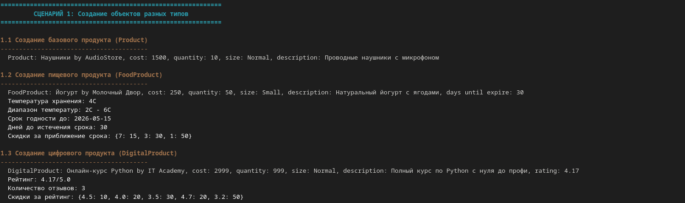
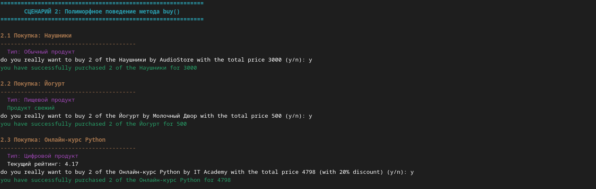
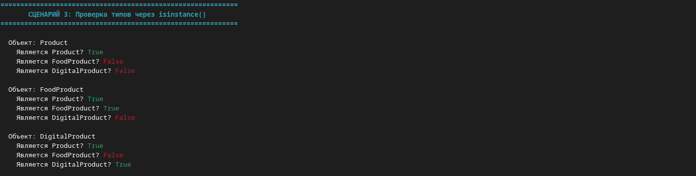
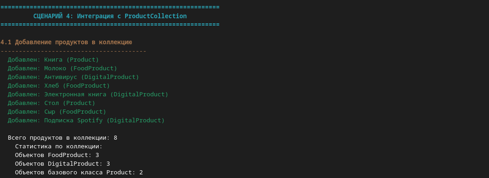
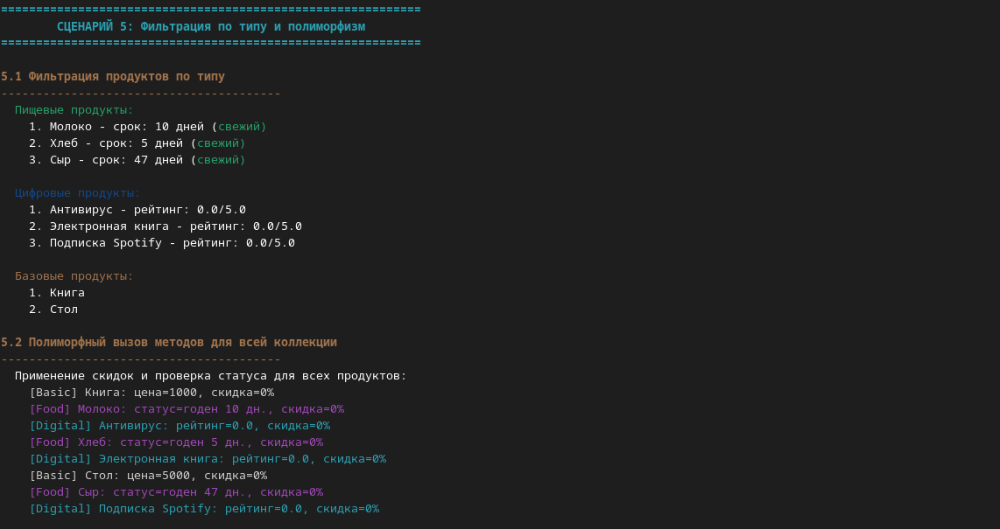
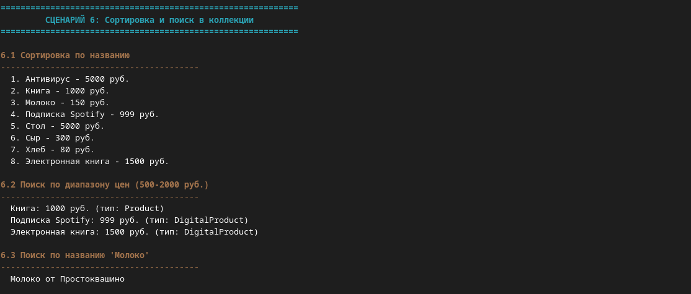
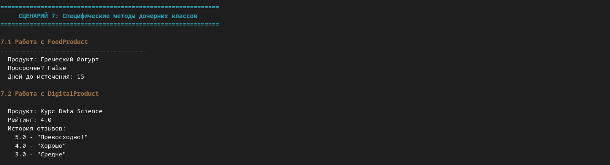

# ЛР-3 — Наследование и иерархия классов (Product)

### Базовый класс (`Product`)
- Инкапсуляция атрибутов (название, цена, продавец, количество, описание, размер)
- Валидация данных
- История скидок (кольцевой буфер)
- Методы: покупка, добавление товара, применение/снятие скидки, вывод в файл/консоль

### Дочерние классы

#### `FoodProduct` (Пищевой продукт)
**Новые атрибуты:**
- `expiration_date` — срок годности
- `storage_temp`, `min_temp`, `max_temp` — температурный режим хранения
- `__expire_discount` — словарь скидок за приближение срока годности

**Новые методы:**
- `is_expired()` — проверка на просрочку
- `get_days_until_expiry()` — дней до истечения срока
- `add_expire_discount()` — добавление скидки за N дней до истечения
- `update()` — автоматическое применение максимальной скидки
- `buy()` — переопределён с учётом невозможности покупки просрочки

#### `DigitalProduct` (Цифровой продукт)
**Новые атрибуты:**
- `__rating` — средний рейтинг
- `__reviews_history` — список отзывов
- `__discount_for_rating` — скидки при достижении определённого рейтинга

**Новые методы:**
- `add_review()` — добавить отзыв и пересчитать рейтинг
- `add_rating_discount()` — скидка при рейтинге ≤ заданного
- `update()` — авто-применение скидки по рейтингу
- `buy()` — переопределён с предварительным обновлением скидки

### Полиморфное поведение
- `update()` — разная логика расчёта скидки (FoodProduct: по сроку годности; DigitalProduct: по рейтингу)
- `buy()` — общий интерфейс с разной внутренней проверкой
- `__str__()` — разное представление объектов
- `print_history()` — вывод истории скидок / отзывов / рейтингов

## Демонстрация (`demo.py`)

1. Создание объектов разных типов  
   

2. Полиморфные вызовы метода `buy()`  
   

3. Проверка типов через `isinstance()`  
   

4. Коллекция `ProductCollection` + фильтрация по типам  
   
   

5. Фильтрация по типам и полиморфизм
   

6. Сортировка и поиск в коллекции
       

7. Специфические методы дочерних классов  
   