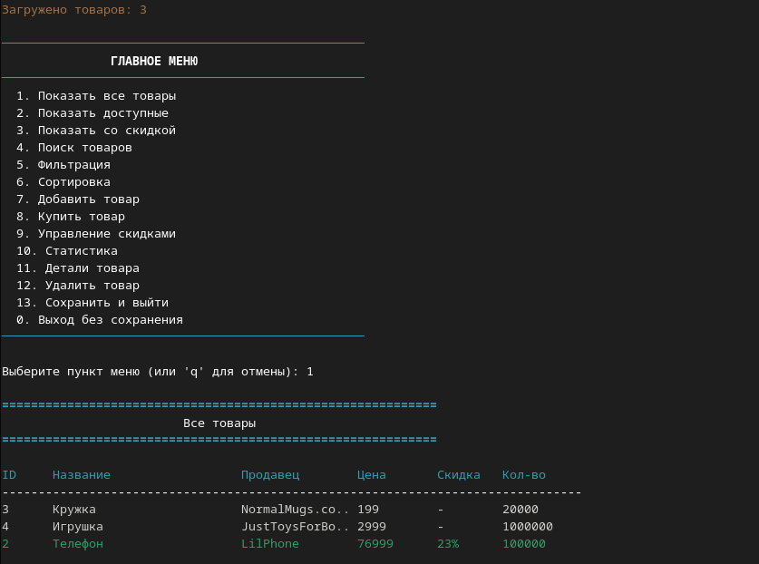
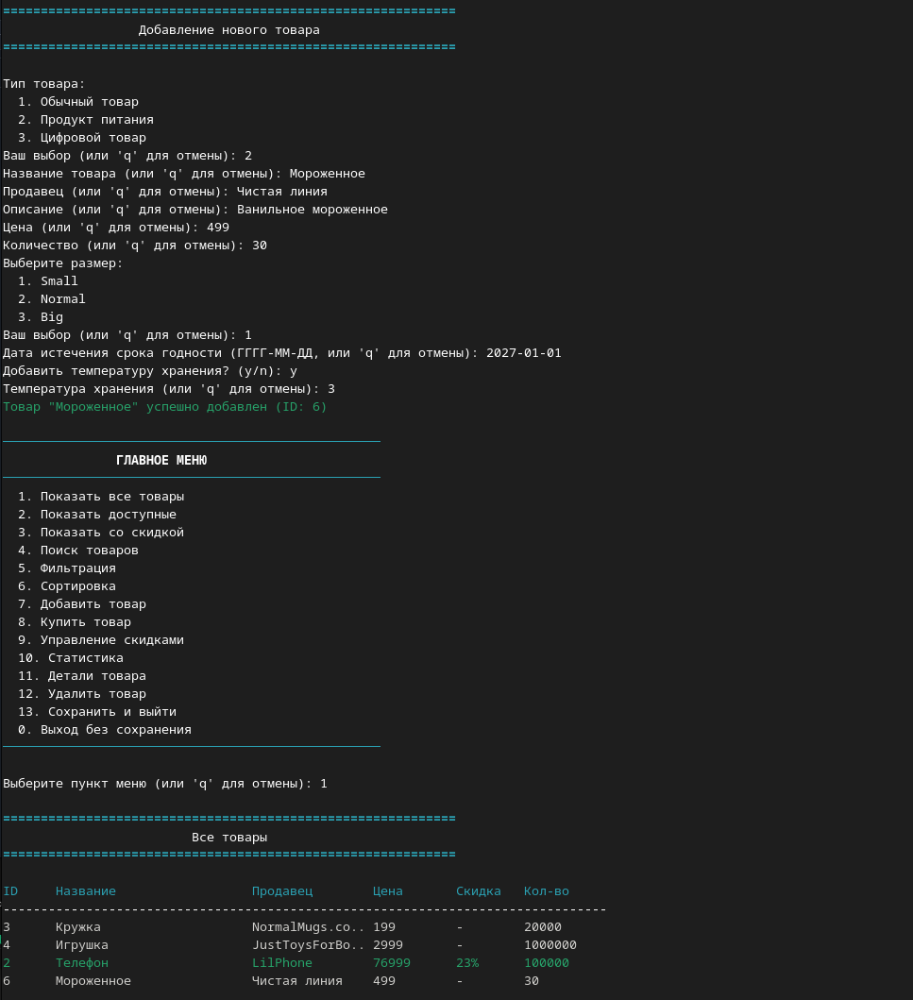
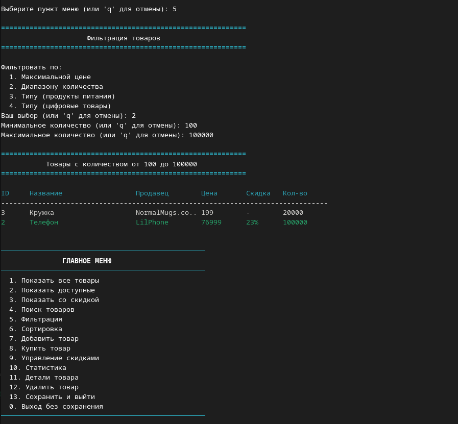
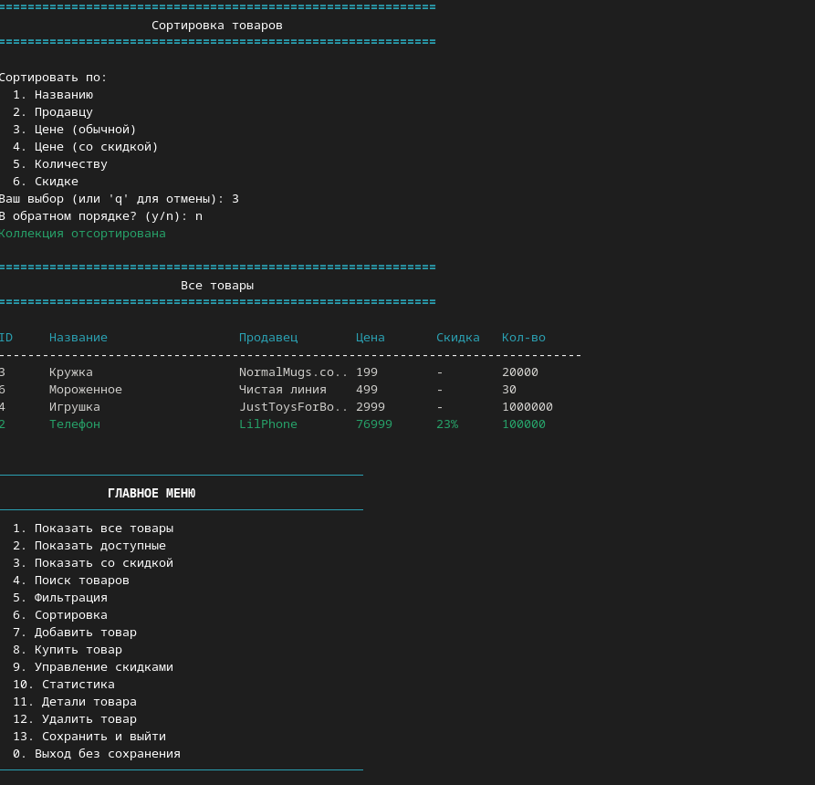
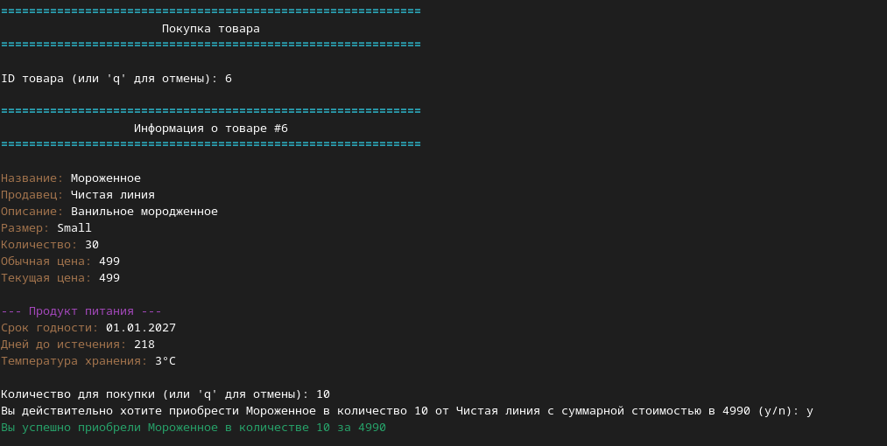
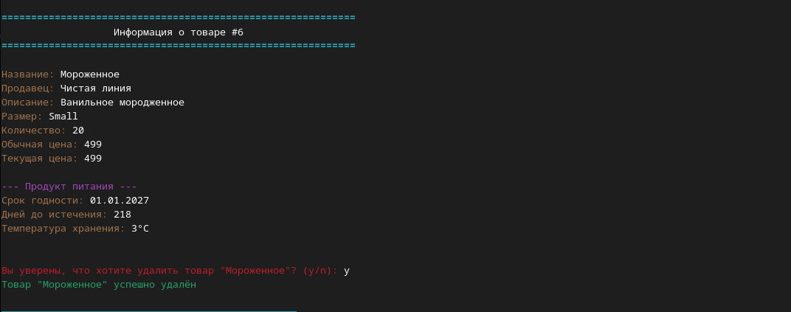
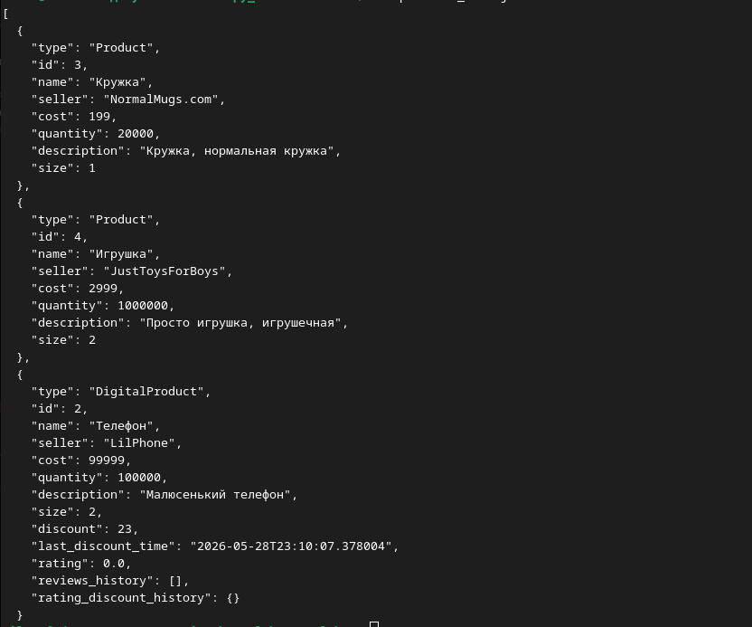
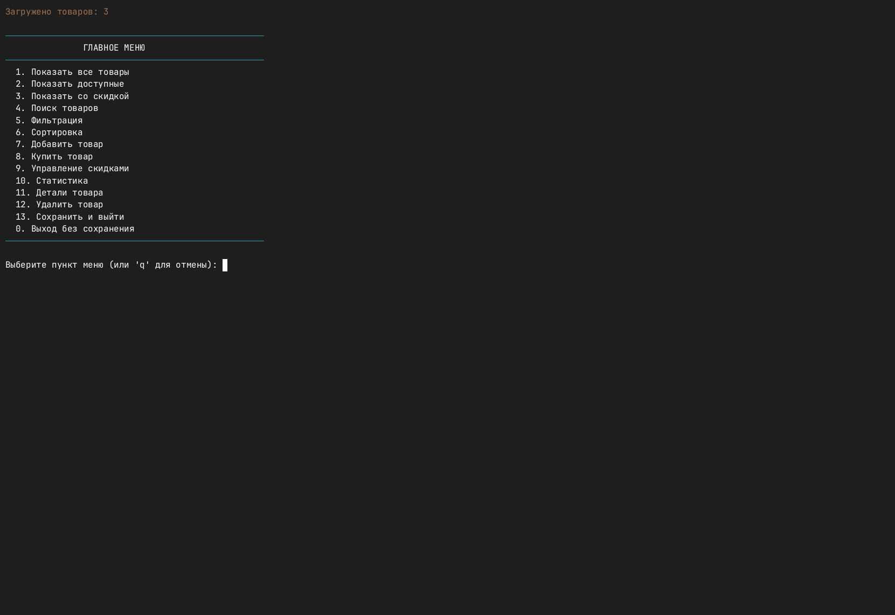

# Лабораторная работа №7: Консольное приложение

## Цель
Создать интерактивное CLI-приложение для управления товарами, объединив всё изученное: ООП, коллекции, функции высшего порядка, типизацию, файловый ввод/вывод.

## Структура проекта
- `main.py` – запуск, загрузка/сохранение
- `cli.py` – меню, ввод/вывод
- `app.py` – бизнес-логика
- `exceptions.py` – собственные ошибки
- `storage.py` – JSON-сериализация

## Реализованные возможности
- Добавление товаров трёх типов (обычный, продукт питания, цифровой)
- Просмотр всех товаров в таблице с цветовым выделением
- Поиск по ID, названию и продавцу
- Фильтрация по цене, количеству и типу товара
- Сортировка по названию, продавцу, цене, количеству, скидке
- Покупка товара с проверкой наличия
- Управление скидками (ручное применение, автообновление для Food/Digital)
- Детальная информация о товаре (история скидок, срок годности, рейтинг)
- Статистика (количество, общая стоимость, сэкономлено по скидкам)
- Удаление с подтверждением
- Автоматическое сохранение/загрузка в JSON
- Обработка ошибок ввода и собственных исключений

## Скриншоты

## asciinema
